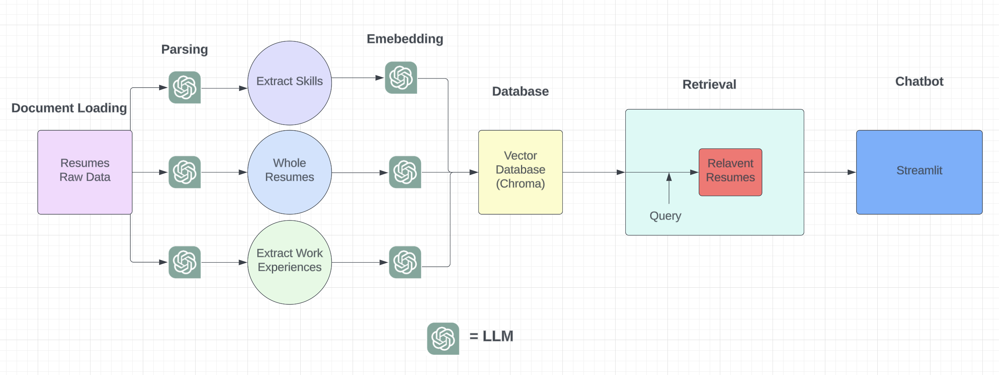

# Resume-Rater-Engine

The Resume-Rater-Engine is a comprehensive system that harnesses the potential of artificial intelligence and machine learning to enhance and automate the recruitment process. It generates, categorizes, and scores resumes based on employer criteria and job descriptions.

## Workflow:

1. **Resume Generation**: Leverage ChatGPT to create 66 unique resumes for diverse roles including Data Scientists, Data Analysts, Data Engineers, and Software Engineers with varying job titles. The diversity in job titles reflects the real-world scenarios where a Data Scientist, for instance, may also be called a Machine Learning Scientist.

2. **Data Extraction**: Parse the generated resumes with LangChain and GPT-3.5, extracting valuable data points such as technical skills and work experiences, which includes job titles, durations, and projects involved.

3. **Data Storage**: Store the extracted data, including the entire resume, skills list, and job experiences, in Chroma - a vector database.

4. **Advanced Search and Ranking**: Allow employers to set a rubric or assign weights to prioritize certain skills, followed by a ranking of resumes based on these criteria. The ranking system searches the entire resume or specific sections for matching skills.

5. **Deployment**: Investigate the potential of deploying this solution in a Streamlit application for broader accessibility.

## Future Enhancements:

The aspiration for this project is to mature it into a robust data engineering product through the following enhancements:

1. **Resume Submission and Storage**: Enable individuals to submit their resumes directly to employers and facilitate the storage of these resumes on a cloud platform.

2. **Batch Processing**: Implement batch processing capabilities using AWS Lambda functions or Apache Airflow.

3. **Employer Interface**: Create an interface that allows employers to interact with this resume database through various predefined processes.

4. **Knowledge Graph Integration with Neo4j**: Leverage a knowledge graph to link diverse information within the resume database, providing advanced search capabilities like mapping the shortest distance between skillsets or using graph embeddings to identify similarities among resumes.

5. **AI Filtering**: Provide employers with the ability to specify requirements (e.g., a particular skill), and have the system generate a list of candidates who meet these specifications.

6. **AI Scoring**: Enable employers to input their job description and receive a score for each resume, assisting them during the hiring process by highlighting the most suitable candidates.

### Note:

Skills such as "Critical Thinking" and "Scrum/Agile methodology," often labeled as "soft skills," are considered less tangible than technical abilities like knowledge of specific programming languages or tools. While these skills might be less distinguishing among highly technical roles, their importance in the broader context of job performance is undeniable.